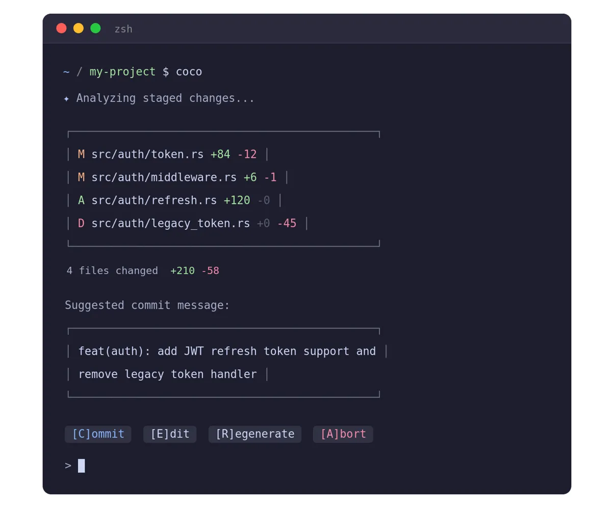

# coco 🥥

> Generate commit messages from staged changes using local AI — powered by Ollama.



---

## Features

- **Local-first** — runs entirely on your machine via Ollama, no data leaves your system
- **Conventional Commits** — supports `feat:`, `fix:`, `chore:`, `refactor:`, and more
- **Interactive** — review, edit, or regenerate before committing
- **Configurable** — set your preferred provider, model, and format via `config.toml`
- **Extensible** — provider and formatter system designed for easy contribution

---

## Installation

### Prerequisites

- [Rust](https://rustup.rs/) 1.85+ (edition 2024)
- [Ollama](https://ollama.com/) running locally

### From source

```bash
git clone https://github.com/yourusername/coco
cd coco
cargo install --path .
```

---

## Usage

```bash
# Stage your changes first
git add .

# Run coco
coco
```

### Flags

| Flag | Short | Description |
|---|---|---|
| `--always-trust` | `-y` | Skip confirmation and commit immediately |
| `--provider` | `-p` | Override provider (e.g. `ollama`, `openai`) |
| `--model` | `-m` | Override model (e.g. `qwen3.5`, `llama3.2`) |
| `--help` | `-h` | Print help |
| `--version` | `-V` | Print version |

### Examples

```bash
coco                          # use default config
coco -y                       # auto-commit, no confirmation
coco -m qwen3.5               # use specific model
coco -p openai -m gpt-4o      # use different provider
coco -p ollama -m qwen3.5 -y  # combine flags
```

---

## Configuration

Config file is located at `~/.config/coco/config.toml`. Created automatically on first run with defaults.

```toml
[core]
format = "conventional"   # or "freeform"
language = "english"

[provider]
name = "ollama"
model = "qwen3.5"

[provider.ollama]
base_url = "http://localhost:11434"

[provider.openai]
api_key = "sk-..."
base_url = "https://api.openai.com/v1"
```

### Priority chain

```
CLI flags  →  config.toml  →  defaults
```

---

## Supported Providers

| Provider | Status |
|---|---|
| Ollama (local) | ✅ Available |
| OpenAI | 🔜 Soon |
| Anthropic | 🔜 Soon |
| Groq | 🔜 Soon |

---

## Supported Models (via Ollama)

Any model available in Ollama works with coco. Recommended:

```bash
ollama pull qwen3.5        # recommended, best quality
ollama pull qwen3.5:0.8b   # lightweight, faster
ollama pull llama3.2       # alternative
```

---

## Contributing

Contributions are welcome! See [CONTRIBUTING.md](CONTRIBUTING.md) for how to add new providers, formatters, and more.

---

## License

MIT